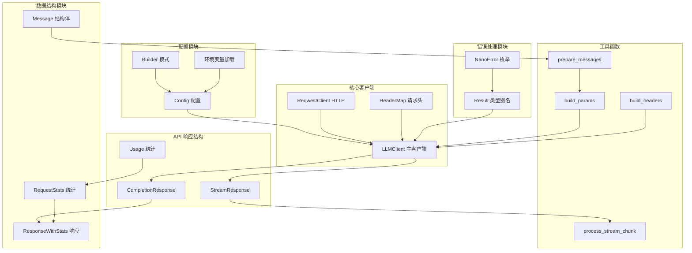
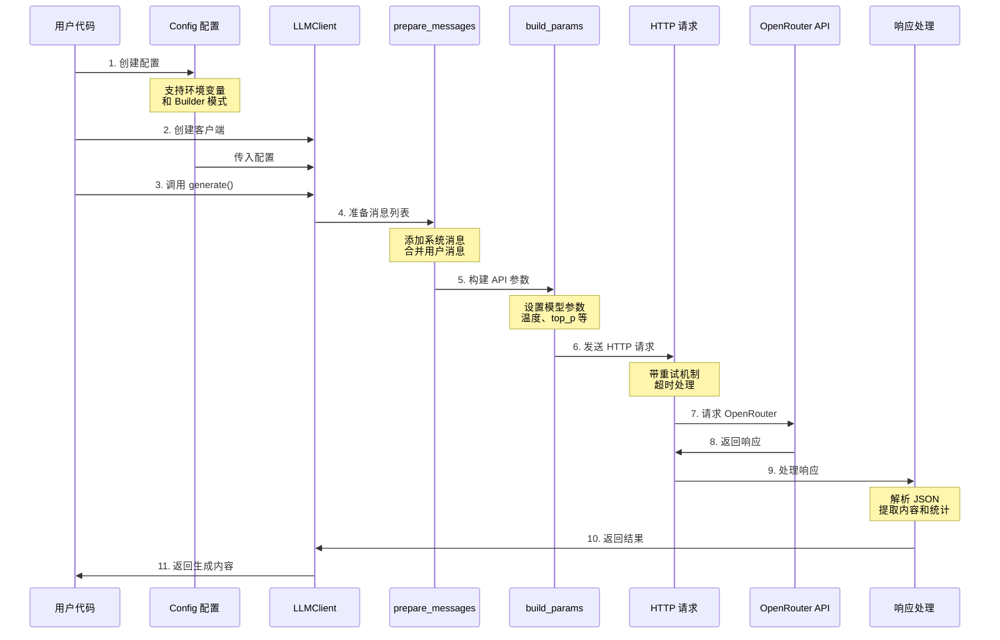
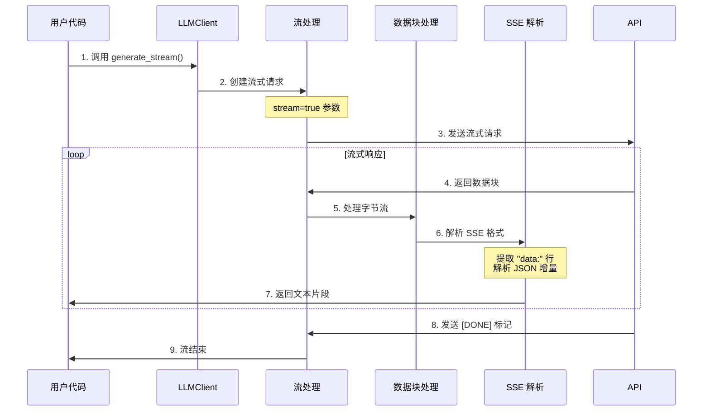
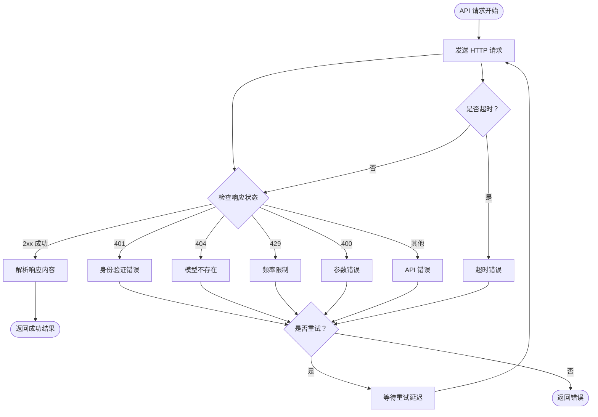
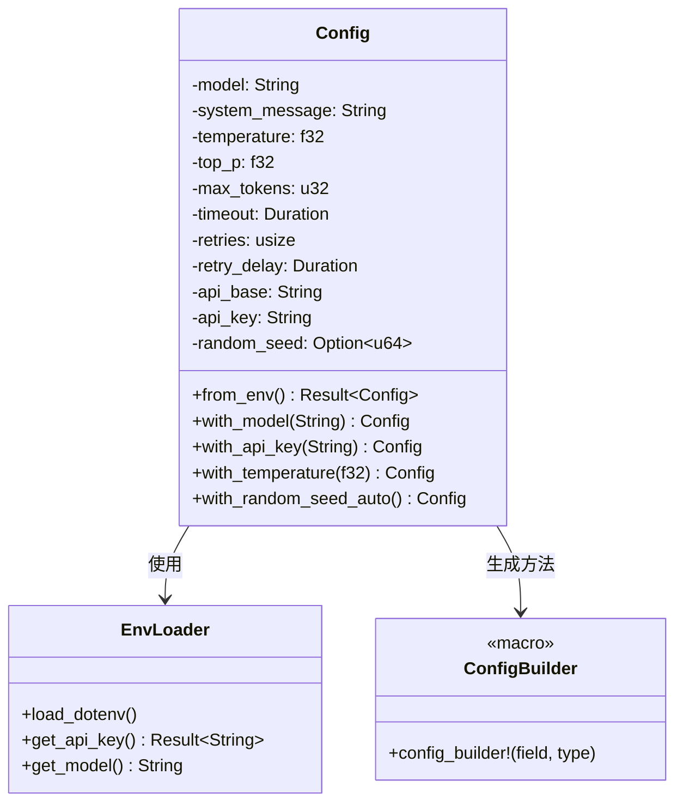
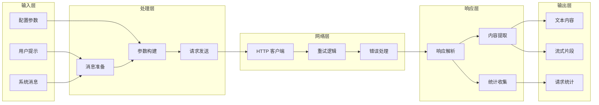
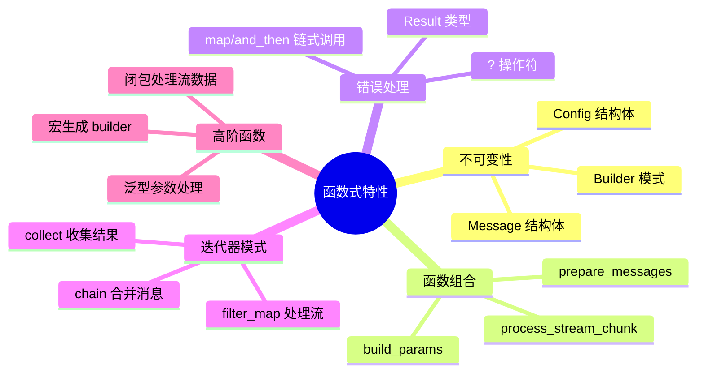
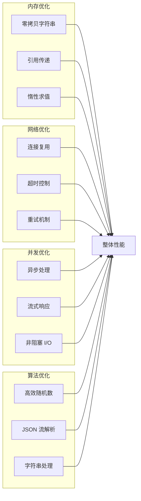

# NanoAI 架构文档

## 代码结构概览

```mermaid
graph TB
    subgraph "错误处理模块"
        NanoError["NanoError 枚举"]
        Result["Result<T> 类型别名"]
    end
    
    subgraph "数据结构模块"
        Message["Message 结构体"]
        RequestStats["RequestStats 统计"]
        ResponseWithStats["ResponseWithStats 响应"]
    end
    
    subgraph "配置模块"
        Config["Config 配置"]
        ConfigBuilder["Builder 模式"]
        EnvLoader["环境变量加载"]
    end
    
    subgraph "API 响应结构"
        CompletionResponse["CompletionResponse"]
        StreamResponse["StreamResponse"]
        Usage["Usage 统计"]
    end
    
    subgraph "核心客户端"
        LLMClient["LLMClient 主客户端"]
        HttpClient["ReqwestClient HTTP"]
        Headers["HeaderMap 请求头"]
    end
    
    subgraph "工具函数"
        PrepareMessages["prepare_messages"]
        BuildParams["build_params"]
        BuildHeaders["build_headers"]
        ProcessStream["process_stream_chunk"]
    end
    
    Config --> LLMClient
    ConfigBuilder --> Config
    EnvLoader --> Config
    Message --> PrepareMessages
    PrepareMessages --> BuildParams
    BuildParams --> LLMClient
    BuildHeaders --> LLMClient
    HttpClient --> LLMClient
    Headers --> LLMClient
    LLMClient --> CompletionResponse
    LLMClient --> StreamResponse
    CompletionResponse --> ResponseWithStats
    StreamResponse --> ProcessStream
    Usage --> RequestStats
    RequestStats --> ResponseWithStats
    NanoError --> Result
    Result --> LLMClient
```

## 数据流转图

```mermaid
sequenceDiagram
    participant User as 用户代码
    participant Config as Config 配置
    participant Client as LLMClient
    participant Prepare as prepare_messages
    participant Build as build_params
    participant HTTP as HTTP 请求
    participant API as OpenRouter API
    participant Handle as 响应处理
    
    User->>Config: 1. 创建配置
    Note over Config: 支持环境变量<br/>和 Builder 模式
    
    User->>Client: 2. 创建客户端
    Config->>Client: 传入配置
    
    User->>Client: 3. 调用 generate()
    Client->>Prepare: 4. 准备消息列表
    Note over Prepare: 添加系统消息<br/>合并用户消息
    
    Prepare->>Build: 5. 构建 API 参数
    Note over Build: 设置模型参数<br/>温度、top_p 等
    
    Build->>HTTP: 6. 发送 HTTP 请求
    Note over HTTP: 带重试机制<br/>超时处理
    
    HTTP->>API: 7. 请求 OpenRouter
    API->>HTTP: 8. 返回响应
    
    HTTP->>Handle: 9. 处理响应
    Note over Handle: 解析 JSON<br/>提取内容和统计
    
    Handle->>Client: 10. 返回结果
    Client->>User: 11. 返回生成内容
```

## 流式响应数据流

```mermaid
sequenceDiagram
    participant User as 用户代码
    participant Client as LLMClient
    participant Stream as 流处理
    participant Chunk as 数据块处理
    participant SSE as SSE 解析
    
    User->>Client: 1. 调用 generate_stream()
    Client->>Stream: 2. 创建流式请求
    Note over Stream: stream=true 参数
    
    Stream->>API: 3. 发送流式请求
    
    loop 流式响应
        API->>Stream: 4. 返回数据块
        Stream->>Chunk: 5. 处理字节流
        Chunk->>SSE: 6. 解析 SSE 格式
        Note over SSE: 提取 "data:" 行<br/>解析 JSON 增量
        SSE->>User: 7. 返回文本片段
    end
    
    API->>Stream: 8. 发送 [DONE] 标记
    Stream->>User: 9. 流结束
```

## 错误处理流程

```mermaid
flowchart TD
    Start(["API 请求开始"]) --> Send["发送 HTTP 请求"]
    Send --> Check{"检查响应状态"}
    
    Check -->|"2xx 成功"| Parse["解析响应内容"]
    Check -->|"401"| AuthError["身份验证错误"]
    Check -->|"404"| ModelError["模型不存在"]
    Check -->|"429"| RateError["频率限制"]
    Check -->|"400"| ParamError["参数错误"]
    Check -->|"其他"| ApiError["API 错误"]
    
    Parse --> Success(["返回成功结果"])
    
    AuthError --> Retry{"是否重试？"}
    ModelError --> Retry
    RateError --> Retry
    ParamError --> Retry
    ApiError --> Retry
    
    Retry -->|"是"| Wait["等待重试延迟"]
    Retry -->|"否"| Error(["返回错误"])
    
    Wait --> Send
    
    Send --> Timeout{"是否超时？"}
    Timeout -->|"是"| TimeoutError["超时错误"]
    Timeout -->|"否"| Check
    
    TimeoutError --> Retry
```

## 配置系统架构

```mermaid
classDiagram
    class Config {
        -model: String
        -system_message: String
        -temperature: f32
        -top_p: f32
        -max_tokens: u32
        -timeout: Duration
        -retries: usize
        -retry_delay: Duration
        -api_base: String
        -api_key: String
        -random_seed: Option~u64~
        
        +from_env() Result~Config~
        +with_model(String) Config
        +with_api_key(String) Config
        +with_temperature(f32) Config
        +with_random_seed_auto() Config
    }
    
    class EnvLoader {
        +load_dotenv()
        +get_api_key() Result~String~
        +get_model() String
    }
    
    class ConfigBuilder {
        <<macro>>
        +config_builder!(field, type)
    }
    
    Config --> EnvLoader : 使用
    Config --> ConfigBuilder : 生成方法
```

## 核心组件交互

```mermaid
graph LR
    subgraph "输入层"
        UserPrompt["用户提示"]
        SystemMsg["系统消息"]
        ConfigParams["配置参数"]
    end
    
    subgraph "处理层"
        MessagePrep["消息准备"]
        ParamBuild["参数构建"]
        RequestSend["请求发送"]
    end
    
    subgraph "网络层"
        HTTPClient["HTTP 客户端"]
        RetryLogic["重试逻辑"]
        ErrorHandle["错误处理"]
    end
    
    subgraph "响应层"
        ResponseParse["响应解析"]
        ContentExtract["内容提取"]
        StatsCollect["统计收集"]
    end
    
    subgraph "输出层"
        TextContent["文本内容"]
        StreamChunks["流式片段"]
        Statistics["请求统计"]
    end
    
    UserPrompt --> MessagePrep
    SystemMsg --> MessagePrep
    ConfigParams --> ParamBuild
    MessagePrep --> ParamBuild
    ParamBuild --> RequestSend
    RequestSend --> HTTPClient
    HTTPClient --> RetryLogic
    RetryLogic --> ErrorHandle
    ErrorHandle --> ResponseParse
    ResponseParse --> ContentExtract
    ResponseParse --> StatsCollect
    ContentExtract --> TextContent
    ContentExtract --> StreamChunks
    StatsCollect --> Statistics
```

## 函数式编程特性

```mermaid
mindmap
  root((函数式特性))
    不可变性
      Config 结构体
      Message 结构体
      Builder 模式
    
    函数组合
      prepare_messages
      build_params
      process_stream_chunk
    
    错误处理
      Result 类型
      ? 操作符
      map/and_then 链式调用
    
    迭代器模式
      filter_map 处理流
      chain 合并消息
      collect 收集结果
    
    高阶函数
      宏生成 builder
      泛型参数处理
      闭包处理流数据
```

## 性能优化点

```mermaid
flowchart LR
    subgraph "内存优化"
        A1["零拷贝字符串"]
        A2["引用传递"]
        A3["惰性求值"]
    end
    
    subgraph "网络优化"
        B1["连接复用"]
        B2["超时控制"]
        B3["重试机制"]
    end
    
    subgraph "并发优化"
        C1["异步处理"]
        C2["流式响应"]
        C3["非阻塞 I/O"]
    end
    
    subgraph "算法优化"
        D1["高效随机数"]
        D2["JSON 流解析"]
        D3["字符串处理"]
    end
    
    A1 --> Performance["整体性能"]
    A2 --> Performance
    A3 --> Performance
    B1 --> Performance
    B2 --> Performance
    B3 --> Performance
    C1 --> Performance
    C2 --> Performance
    C3 --> Performance
    D1 --> Performance
    D2 --> Performance
    D3 --> Performance
```